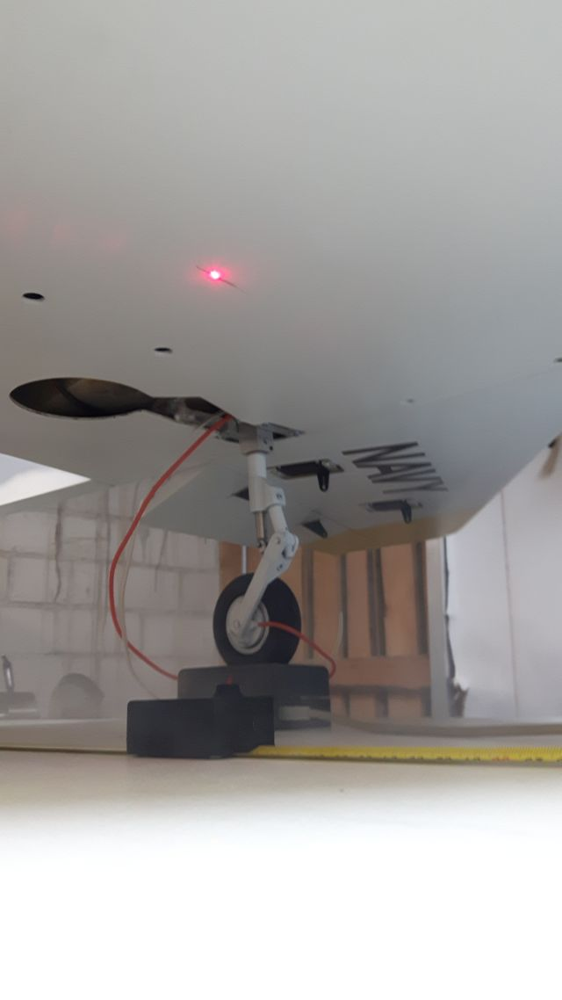
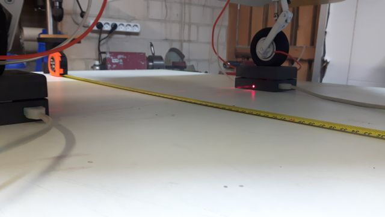
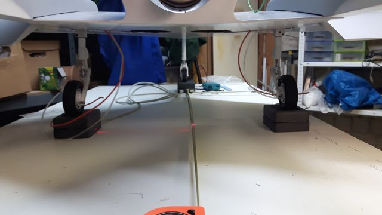
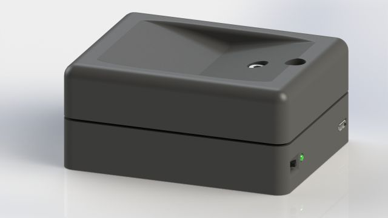
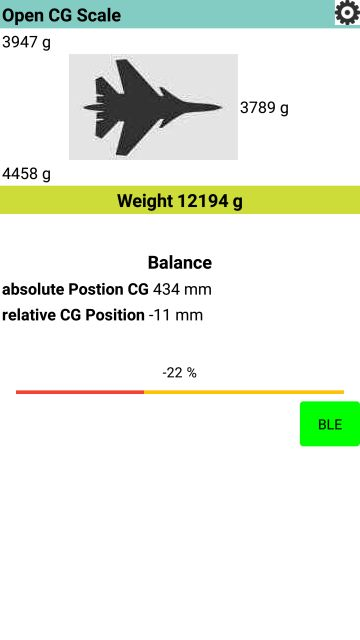
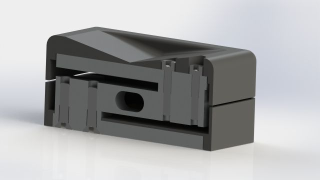
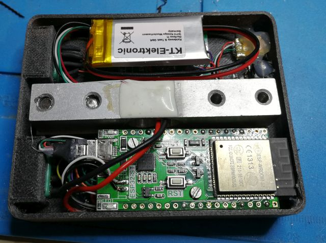
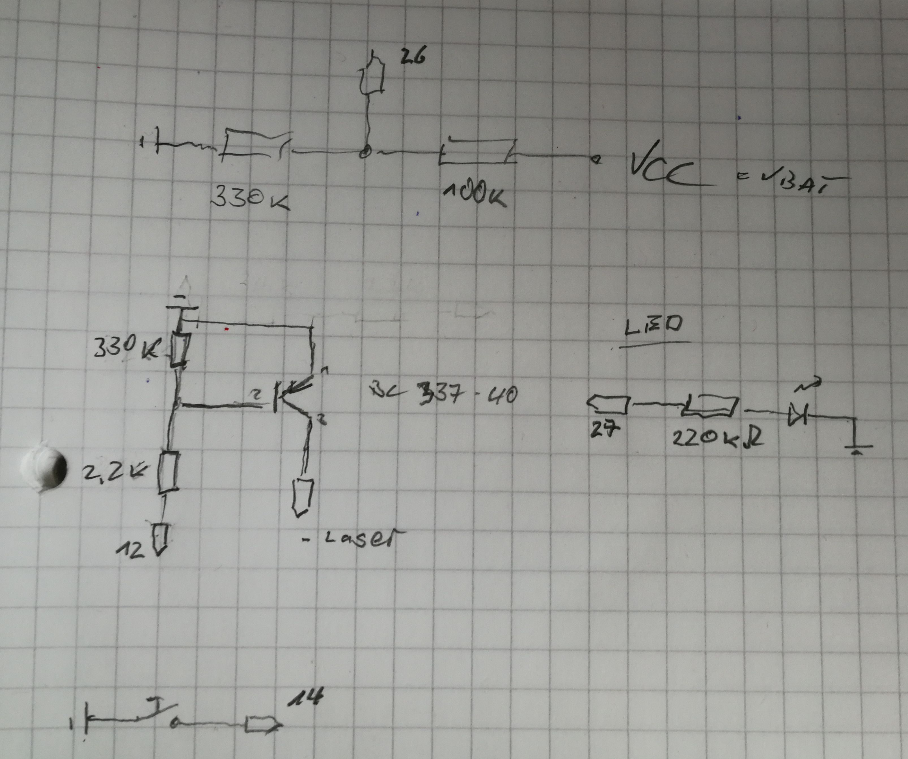
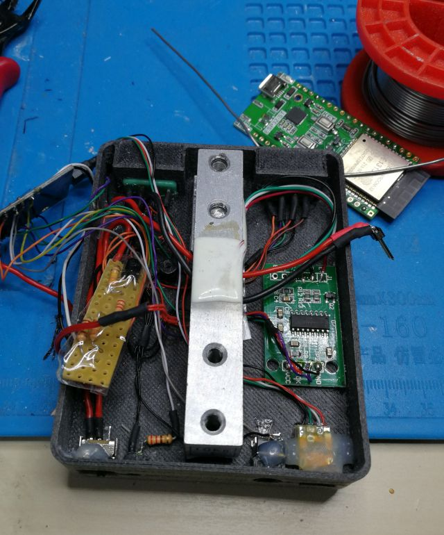

# CG-Scale

The complete project is open source. 

The weight and the CG is measured by 3 scale modules places under the landing gear of the airplane. Everything is powered by an ESP32.
The position of the CG is projected by a laser on the button of the plane. 

Measuring of distance is supported by a laser, that points to the middle of the main gear.

All information are shown on a Android app via bluetooth 4.0 low energy. 

All parts are printed 3d. Files are provided as [(STL)](..\CG_Scale\Parts\STL). Some aluminium parts are required. But they can simply be cutted from aluminium profile [(PDF)](..\CG_Scale\Parts\Alu-Parts_Drawing.PDF).

## Hardware
### Based on ESP32. 

* Used Board ESP32 WeMos LOLIN32 Lite V1.0.0
	* https://wiki.wemos.cc/products:lolin32:lolin32_lite
	* https://arduino-projekte.info/wemos-lolin32-lite/ (German)
* The Board provides an Lipo Battery Charger
### Scale

* Used 10 kg load cell together with the [HX-711](https://github.com/bogde/HX711.git) board you can find for exmaple
  * on ebay: https://tinyurl.com/ybxn4rfh
  * on aliexpress: https://tinyurl.com/y78dd9gv

### Laser pointer module
 * From ebay like https://tinyurl.com/y8mcnznn
 * Aliexpress https://tinyurl.com/ydeltejj

## Used Libaries
* Used Libraries from espressif. See https://github.com/espressif/arduino-esp32/blob/master/docs/arduino-ide/boards_manager.md for installation.
* HX-711 Board: https://github.com/bogde/HX711.git

# Circuit

The PIN-setting to the esp32 is configured in the config.h file.

